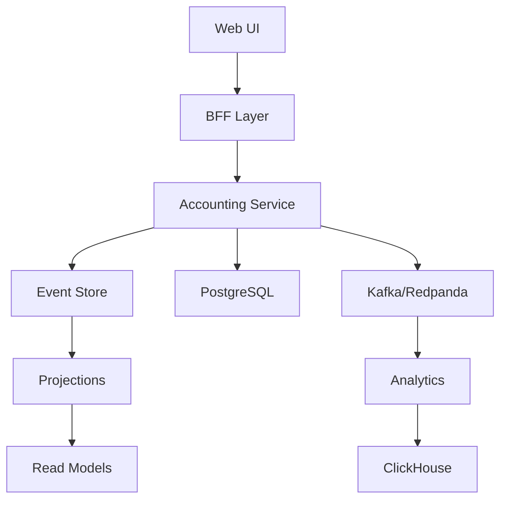

# Technical Implementation Guide - Accounting Top-Up

## 🏗️ **Architecture Overview**

### **Current Architecture (Validated)**



## 📁 **File Structure Changes**

### **Phase 1: User Experience Enhancement**

```
apps/web/src/
├── app/
│   └── accounting/
│       ├── page.tsx                 # Main dashboard
│       ├── journal-entries/
│       │   └── page.tsx            # Journal entry management
│       ├── chart-of-accounts/
│       │   └── page.tsx            # COA management
│       ├── reports/
│       │   └── page.tsx            # Financial reports
│       └── analytics/
│           └── page.tsx            # Analytics dashboard
├── components/
│   └── accounting/
│       ├── JournalEntryForm.tsx    # Journal entry form
│       ├── ChartOfAccounts.tsx     # COA management
│       ├── FinancialReports.tsx    # Report viewer
│       ├── TrialBalance.tsx        # Trial balance
│       └── FinancialDashboard.tsx  # Main dashboard
├── hooks/
│   └── useAccounting.ts           # Accounting API hooks
└── lib/
    └── accounting-api.ts           # API client
```

### **Phase 2: Advanced Analytics**

```
packages/accounting/src/
├── services/
│   ├── advanced-analytics.service.ts    # Analytics engine
│   ├── predictive-insights.service.ts   # Predictive modeling
│   └── benchmarking.service.ts          # Industry benchmarking
└── projections/
    └── analytics-projection.ts          # Analytics projections
```

### **Phase 3: Documentation & Tools**

```
packages/accounting/
├── docs/
│   ├── api-reference.md                 # API documentation
│   ├── developer-guide.md               # Developer guide
│   ├── architecture.md                  # Architecture docs
│   └── deployment.md                    # Deployment guide
├── scripts/
│   ├── generate-coa.ts                   # COA generation
│   ├── migrate-data.ts                  # Data migration
│   └── validate-integrity.ts            # Integrity validation
└── src/api/
    └── swagger.config.ts                # Swagger configuration
```

## 🔧 **Technical Implementation**

### **1. Web UI Foundation**

#### **Dependencies**

```json
{
  "dependencies": {
    "@tanstack/react-query": "^5.0.0",
    "@tanstack/react-table": "^8.0.0",
    "recharts": "^2.8.0",
    "react-hook-form": "^7.48.0",
    "zod": "^3.22.0",
    "@hookform/resolvers": "^3.3.0",
    "lucide-react": "^0.294.0",
    "tailwindcss": "^3.3.0",
    "@headlessui/react": "^1.7.0"
  }
}
```

#### **API Client Implementation**

```typescript
// apps/web/src/lib/accounting-api.ts
import { useQuery, useMutation, useQueryClient } from '@tanstack/react-query';

export interface JournalEntry {
  id: string;
  reference: string;
  description: string;
  entries: JournalEntryLine[];
  status: 'DRAFT' | 'POSTED' | 'REVERSED';
  createdAt: Date;
  updatedAt: Date;
}

export interface JournalEntryLine {
  accountCode: string;
  debitAmount: number;
  creditAmount: number;
  description?: string;
}

export interface CreateJournalEntryRequest {
  reference: string;
  description: string;
  entries: JournalEntryLine[];
  tenantId: string;
}

class AccountingApiClient {
  private baseUrl: string;

  constructor(baseUrl: string = '/api/v1/accounting') {
    this.baseUrl = baseUrl;
  }

  async createJournalEntry(data: CreateJournalEntryRequest): Promise<JournalEntry> {
    const response = await fetch(`${this.baseUrl}/journal-entries`, {
      method: 'POST',
      headers: {
        'Content-Type': 'application/json',
        'X-Tenant-Id': data.tenantId,
      },
      body: JSON.stringify(data),
    });

    if (!response.ok) {
      throw new Error(`Failed to create journal entry: ${response.statusText}`);
    }

    return response.json();
  }

  async getJournalEntries(tenantId: string, limit = 50, offset = 0): Promise<JournalEntry[]> {
    const response = await fetch(
      `${this.baseUrl}/journal-entries?limit=${limit}&offset=${offset}`,
      {
        headers: {
          'X-Tenant-Id': tenantId,
        },
      },
    );

    if (!response.ok) {
      throw new Error(`Failed to fetch journal entries: ${response.statusText}`);
    }

    return response.json();
  }

  async getTrialBalance(tenantId: string, period: string): Promise<any> {
    const response = await fetch(`${this.baseUrl}/trial-balance/${tenantId}/${period}`);

    if (!response.ok) {
      throw new Error(`Failed to fetch trial balance: ${response.statusText}`);
    }

    return response.json();
  }

  async getProfitAndLoss(tenantId: string, period: string): Promise<any> {
    const response = await fetch(`${this.baseUrl}/reports/pnl/${tenantId}/${period}`);

    if (!response.ok) {
      throw new Error(`Failed to fetch P&L: ${response.statusText}`);
    }

    return response.json();
  }

  async getBalanceSheet(tenantId: string): Promise<any> {
    const response = await fetch(`${this.baseUrl}/reports/balance-sheet/${tenantId}`);

    if (!response.ok) {
      throw new Error(`Failed to fetch balance sheet: ${response.statusText}`);
    }

    return response.json();
  }
}

export const accountingApi = new AccountingApiClient();
```

#### **React Hooks Implementation**

```typescript
// apps/web/src/hooks/useAccounting.ts
import { useQuery, useMutation, useQueryClient } from '@tanstack/react-query';
import { accountingApi } from '@/lib/accounting-api';

export function useAccounting() {
  const queryClient = useQueryClient();

  const journalEntries = useQuery({
    queryKey: ['journal-entries'],
    queryFn: () => accountingApi.getJournalEntries('tenant-id'),
  });

  const trialBalance = useQuery({
    queryKey: ['trial-balance'],
    queryFn: () => accountingApi.getTrialBalance('tenant-id', '2024-12'),
  });

  const profitLoss = useQuery({
    queryKey: ['profit-loss'],
    queryFn: () => accountingApi.getProfitAndLoss('tenant-id', '2024-12'),
  });

  const balanceSheet = useQuery({
    queryKey: ['balance-sheet'],
    queryFn: () => accountingApi.getBalanceSheet('tenant-id'),
  });

  const postJournalEntry = useMutation({
    mutationFn: accountingApi.createJournalEntry,
    onSuccess: () => {
      queryClient.invalidateQueries({ queryKey: ['journal-entries'] });
      queryClient.invalidateQueries({ queryKey: ['trial-balance'] });
    },
  });

  return {
    journalEntries,
    trialBalance,
    profitLoss,
    balanceSheet,
    postJournalEntry,
  };
}
```

#### **Journal Entry Form Component**

```typescript
// apps/web/src/components/accounting/JournalEntryForm.tsx
import { useForm, useFieldArray } from 'react-hook-form';
import { zodResolver } from '@hookform/resolvers/zod';
import { z } from 'zod';
import { useAccounting } from '@/hooks/useAccounting';
import { Button } from '@/components/ui/button';
import { Input } from '@/components/ui/input';
import { Textarea } from '@/components/ui/textarea';
import { Plus, Trash2 } from 'lucide-react';

const journalEntrySchema = z.object({
  reference: z.string().min(1, 'Reference is required'),
  description: z.string().min(1, 'Description is required'),
  entries: z.array(
    z.object({
      accountCode: z.string().min(1, 'Account code is required'),
      debitAmount: z.number().min(0, 'Debit amount must be positive'),
      creditAmount: z.number().min(0, 'Credit amount must be positive'),
      description: z.string().optional(),
    })
  ).min(2, 'At least 2 entries required'),
});

type JournalEntryFormData = z.infer<typeof journalEntrySchema>;

export function JournalEntryForm() {
  const { postJournalEntry } = useAccounting();
  const form = useForm<JournalEntryFormData>({
    resolver: zodResolver(journalEntrySchema),
    defaultValues: {
      reference: '',
      description: '',
      entries: [
        { accountCode: '', debitAmount: 0, creditAmount: 0, description: '' },
        { accountCode: '', debitAmount: 0, creditAmount: 0, description: '' },
      ],
    },
  });

  const { fields, append, remove } = useFieldArray({
    control: form.control,
    name: 'entries',
  });

  const onSubmit = async (data: JournalEntryFormData) => {
    try {
      await postJournalEntry.mutateAsync({
        ...data,
        tenantId: 'tenant-id', // Get from context
      });
      form.reset();
    } catch (error) {
      console.error('Failed to post journal entry:', error);
    }
  };

  const addEntry = () => {
    append({ accountCode: '', debitAmount: 0, creditAmount: 0, description: '' });
  };

  const removeEntry = (index: number) => {
    if (fields.length > 2) {
      remove(index);
    }
  };

  return (
    <form onSubmit={form.handleSubmit(onSubmit)} className="space-y-6">
      <div className="grid grid-cols-1 md:grid-cols-2 gap-4">
        <div>
          <label htmlFor="reference" className="block text-sm font-medium mb-2">
            Reference
          </label>
          <Input
            id="reference"
            {...form.register('reference')}
            placeholder="Enter reference"
          />
          {form.formState.errors.reference && (
            <p className="text-red-500 text-sm mt-1">
              {form.formState.errors.reference.message}
            </p>
          )}
        </div>

        <div>
          <label htmlFor="description" className="block text-sm font-medium mb-2">
            Description
          </label>
          <Textarea
            id="description"
            {...form.register('description')}
            placeholder="Enter description"
          />
          {form.formState.errors.description && (
            <p className="text-red-500 text-sm mt-1">
              {form.formState.errors.description.message}
            </p>
          )}
        </div>
      </div>

      <div className="space-y-4">
        <div className="flex justify-between items-center">
          <h3 className="text-lg font-semibold">Journal Entries</h3>
          <Button type="button" onClick={addEntry} variant="outline" size="sm">
            <Plus className="w-4 h-4 mr-2" />
            Add Entry
          </Button>
        </div>

        {fields.map((field, index) => (
          <div key={field.id} className="grid grid-cols-1 md:grid-cols-5 gap-4 p-4 border rounded-lg">
            <div>
              <label className="block text-sm font-medium mb-2">Account Code</label>
              <Input
                {...form.register(`entries.${index}.accountCode`)}
                placeholder="Account code"
              />
            </div>

            <div>
              <label className="block text-sm font-medium mb-2">Debit Amount</label>
              <Input
                type="number"
                step="0.01"
                {...form.register(`entries.${index}.debitAmount`, { valueAsNumber: true })}
                placeholder="0.00"
              />
            </div>

            <div>
              <label className="block text-sm font-medium mb-2">Credit Amount</label>
              <Input
                type="number"
                step="0.01"
                {...form.register(`entries.${index}.creditAmount`, { valueAsNumber: true })}
                placeholder="0.00"
              />
            </div>

            <div>
              <label className="block text-sm font-medium mb-2">Description</label>
              <Input
                {...form.register(`entries.${index}.description`)}
                placeholder="Description"
              />
            </div>

            <div className="flex items-end">
              <Button
                type="button"
                onClick={() => removeEntry(index)}
                variant="outline"
                size="sm"
                disabled={fields.length <= 2}
              >
                <Trash2 className="w-4 h-4" />
              </Button>
            </div>
          </div>
        ))}
      </div>

      <div className="flex justify-end space-x-4">
        <Button type="button" variant="outline" onClick={() => form.reset()}>
          Reset
        </Button>
        <Button type="submit" disabled={postJournalEntry.isPending}>
          {postJournalEntry.isPending ? 'Posting...' : 'Post Journal Entry'}
        </Button>
      </div>
    </form>
  );
}
```

### **2. Advanced Analytics Implementation**

#### **Analytics Service**

```typescript
// packages/accounting/src/services/advanced-analytics.service.ts
import { Injectable, Logger } from '@nestjs/common';
import { InjectRepository } from '@nestjs/typeorm';
import { Repository } from 'typeorm';
import { AccountEntity } from '../infrastructure/database/entities/account.entity';

export interface TrendAnalysis {
  period: string;
  revenue: number;
  expenses: number;
  netIncome: number;
  growthRate: number;
}

export interface PredictiveInsight {
  metric: string;
  currentValue: number;
  predictedValue: number;
  confidence: number;
  recommendation: string;
}

@Injectable()
export class AdvancedAnalyticsService {
  private readonly logger = new Logger(AdvancedAnalyticsService.name);

  constructor(
    @InjectRepository(AccountEntity)
    private readonly accountRepository: Repository<AccountEntity>,
  ) {}

  async generateTrendAnalysis(tenantId: string, periods: number = 12): Promise<TrendAnalysis[]> {
    const trends: TrendAnalysis[] = [];

    for (let i = 0; i < periods; i++) {
      const period = new Date();
      period.setMonth(period.getMonth() - i);

      const revenue = await this.calculateRevenue(tenantId, period);
      const expenses = await this.calculateExpenses(tenantId, period);
      const netIncome = revenue - expenses;

      trends.push({
        period: period.toISOString().slice(0, 7),
        revenue,
        expenses,
        netIncome,
        growthRate:
          i > 0 ? ((netIncome - trends[i - 1].netIncome) / trends[i - 1].netIncome) * 100 : 0,
      });
    }

    return trends.reverse();
  }

  async generatePredictiveInsights(tenantId: string): Promise<PredictiveInsight[]> {
    const insights: PredictiveInsight[] = [];

    // Revenue prediction
    const revenueInsight = await this.predictRevenue(tenantId);
    insights.push({
      metric: 'Revenue',
      currentValue: revenueInsight.current,
      predictedValue: revenueInsight.predicted,
      confidence: revenueInsight.confidence,
      recommendation: revenueInsight.recommendation,
    });

    return insights;
  }

  private async calculateRevenue(tenantId: string, period: Date): Promise<number> {
    // Implementation for revenue calculation
    return 0;
  }

  private async calculateExpenses(tenantId: string, period: Date): Promise<number> {
    // Implementation for expense calculation
    return 0;
  }

  private async predictRevenue(tenantId: string): Promise<any> {
    // Implementation for revenue prediction
    return { current: 0, predicted: 0, confidence: 0, recommendation: '' };
  }
}
```

### **3. Documentation Implementation**

#### **Swagger Configuration**

```typescript
// packages/accounting/src/api/swagger.config.ts
import { DocumentBuilder, SwaggerModule } from '@nestjs/swagger';
import { INestApplication } from '@nestjs/common';

export function setupSwagger(app: INestApplication): void {
  const config = new DocumentBuilder()
    .setTitle('AI-BOS Accounting API')
    .setDescription('Comprehensive accounting and financial management API')
    .setVersion('2.0.0')
    .addTag('accounts', 'Chart of Accounts Management')
    .addTag('journal-entries', 'Journal Entry Operations')
    .addTag('financial-reports', 'Financial Reporting')
    .addTag('trial-balance', 'Trial Balance Operations')
    .addTag('analytics', 'Advanced Analytics')
    .addBearerAuth()
    .addServer('https://api.aibos.com', 'Production')
    .addServer('https://staging-api.aibos.com', 'Staging')
    .addServer('http://localhost:3001', 'Development')
    .build();

  const document = SwaggerModule.createDocument(app, config);
  SwaggerModule.setup('api/docs', app, document, {
    swaggerOptions: {
      persistAuthorization: true,
      displayRequestDuration: true,
      filter: true,
      showExtensions: true,
      showCommonExtensions: true,
    },
  });
}
```

## 🧪 **Testing Implementation**

### **Unit Tests**

```typescript
// apps/web/src/components/accounting/__tests__/JournalEntryForm.test.tsx
import { render, screen, fireEvent, waitFor } from '@testing-library/react';
import { JournalEntryForm } from '../JournalEntryForm';
import { QueryClient, QueryClientProvider } from '@tanstack/react-query';

const createTestQueryClient = () => new QueryClient({
  defaultOptions: {
    queries: { retry: false },
    mutations: { retry: false },
  },
});

describe('JournalEntryForm', () => {
  let queryClient: QueryClient;

  beforeEach(() => {
    queryClient = createTestQueryClient();
  });

  it('should render form fields', () => {
    render(
      <QueryClientProvider client={queryClient}>
        <JournalEntryForm />
      </QueryClientProvider>
    );

    expect(screen.getByLabelText('Reference')).toBeInTheDocument();
    expect(screen.getByLabelText('Description')).toBeInTheDocument();
    expect(screen.getByText('Journal Entries')).toBeInTheDocument();
  });

  it('should validate required fields', async () => {
    render(
      <QueryClientProvider client={queryClient}>
        <JournalEntryForm />
      </QueryClientProvider>
    );

    const submitButton = screen.getByText('Post Journal Entry');
    fireEvent.click(submitButton);

    await waitFor(() => {
      expect(screen.getByText('Reference is required')).toBeInTheDocument();
      expect(screen.getByText('Description is required')).toBeInTheDocument();
    });
  });
});
```

### **Integration Tests**

```typescript
// packages/accounting/src/__tests__/integration/advanced-analytics.integration.spec.ts
import { Test, TestingModule } from '@nestjs/testing';
import { AdvancedAnalyticsService } from '../../services/advanced-analytics.service';
import { AccountingModule } from '../../accounting.module';

describe('AdvancedAnalyticsService Integration', () => {
  let service: AdvancedAnalyticsService;
  let module: TestingModule;

  beforeAll(async () => {
    module = await Test.createTestingModule({
      imports: [AccountingModule],
    }).compile();

    service = module.get<AdvancedAnalyticsService>(AdvancedAnalyticsService);
  });

  afterAll(async () => {
    await module.close();
  });

  it('should generate trend analysis', async () => {
    const trends = await service.generateTrendAnalysis('tenant-1', 6);

    expect(trends).toHaveLength(6);
    expect(trends[0]).toHaveProperty('period');
    expect(trends[0]).toHaveProperty('revenue');
    expect(trends[0]).toHaveProperty('expenses');
    expect(trends[0]).toHaveProperty('netIncome');
    expect(trends[0]).toHaveProperty('growthRate');
  });

  it('should generate predictive insights', async () => {
    const insights = await service.generatePredictiveInsights('tenant-1');

    expect(insights).toBeInstanceOf(Array);
    expect(insights[0]).toHaveProperty('metric');
    expect(insights[0]).toHaveProperty('currentValue');
    expect(insights[0]).toHaveProperty('predictedValue');
    expect(insights[0]).toHaveProperty('confidence');
    expect(insights[0]).toHaveProperty('recommendation');
  });
});
```

## 🚀 **Deployment Configuration**

### **Docker Configuration**

```dockerfile
# apps/web/Dockerfile
FROM node:18-alpine AS base

# Install dependencies only when needed
FROM base AS deps
RUN apk add --no-cache libc6-compat
WORKDIR /app

# Install dependencies
COPY package.json package-lock.json* ./
RUN npm ci

# Rebuild the source code only when needed
FROM base AS builder
WORKDIR /app
COPY --from=deps /app/node_modules ./node_modules
COPY . .

RUN npm run build

# Production image, copy all the files and run next
FROM base AS runner
WORKDIR /app

ENV NODE_ENV production

RUN addgroup --system --gid 1001 nodejs
RUN adduser --system --uid 1001 nextjs

COPY --from=builder /app/public ./public

# Set the correct permission for prerender cache
RUN mkdir .next
RUN chown nextjs:nodejs .next

# Automatically leverage output traces to reduce image size
COPY --from=builder --chown=nextjs:nodejs /app/.next/standalone ./
COPY --from=builder --chown=nextjs:nodejs /app/.next/static ./.next/static

USER nextjs

EXPOSE 3000

ENV PORT 3000
ENV HOSTNAME "0.0.0.0"

CMD ["node", "server.js"]
```

### **Environment Configuration**

```bash
# .env.production
NODE_ENV=production
DATABASE_HOST=postgres-cluster
DATABASE_PORT=5432
DATABASE_USERNAME=accounting_user
DATABASE_PASSWORD=secure_password
DATABASE_NAME=accounting_db
DATABASE_SSL=true

REDIS_HOST=redis-cluster
REDIS_PORT=6379
REDIS_PASSWORD=secure_redis_password

KAFKA_BROKERS=kafka-cluster:9092
KAFKA_CLIENT_ID=accounting-service

EXCHANGE_RATE_API_KEY=your_api_key
EXCHANGE_RATE_API_URL=https://api.exchangerate-api.com/v4

APP_NAME=aibos-accounting
LOG_LEVEL=info
```

## 📊 **Monitoring & Observability**

### **Health Check Implementation**

```typescript
// packages/accounting/src/controllers/health.controller.ts
import { Controller, Get } from '@nestjs/common';
import { AccountingHealthService } from '../services/accounting-health.service';

@Controller('health')
export class HealthController {
  constructor(private readonly healthService: AccountingHealthService) {}

  @Get()
  async checkHealth() {
    return this.healthService.checkHealth();
  }

  @Get('database')
  async checkDatabase() {
    const isHealthy = await this.healthService.checkDatabaseConnection();
    return { status: isHealthy ? 'up' : 'down' };
  }

  @Get('tenant-isolation')
  async checkTenantIsolation() {
    const isHealthy = await this.healthService.checkTenantIsolation();
    return { status: isHealthy ? 'up' : 'down' };
  }
}
```

### **Metrics Collection**

```typescript
// packages/accounting/src/services/metrics.service.ts
import { Injectable, Logger } from '@nestjs/common';

@Injectable()
export class MetricsService {
  private readonly logger = new Logger(MetricsService.name);

  async recordJournalEntryPosted(tenantId: string, processingTime: number) {
    // Record metrics for journal entry posting
    this.logger.log(`Journal entry posted for tenant ${tenantId} in ${processingTime}ms`);
  }

  async recordTrialBalanceGenerated(tenantId: string, processingTime: number) {
    // Record metrics for trial balance generation
    this.logger.log(`Trial balance generated for tenant ${tenantId} in ${processingTime}ms`);
  }

  async recordError(error: Error, context: string) {
    // Record error metrics
    this.logger.error(`Error in ${context}: ${error.message}`, error.stack);
  }
}
```

---

This technical implementation guide provides the complete technical foundation for implementing the accounting top-up development plan with specific code examples, file structures, and deployment configurations.
