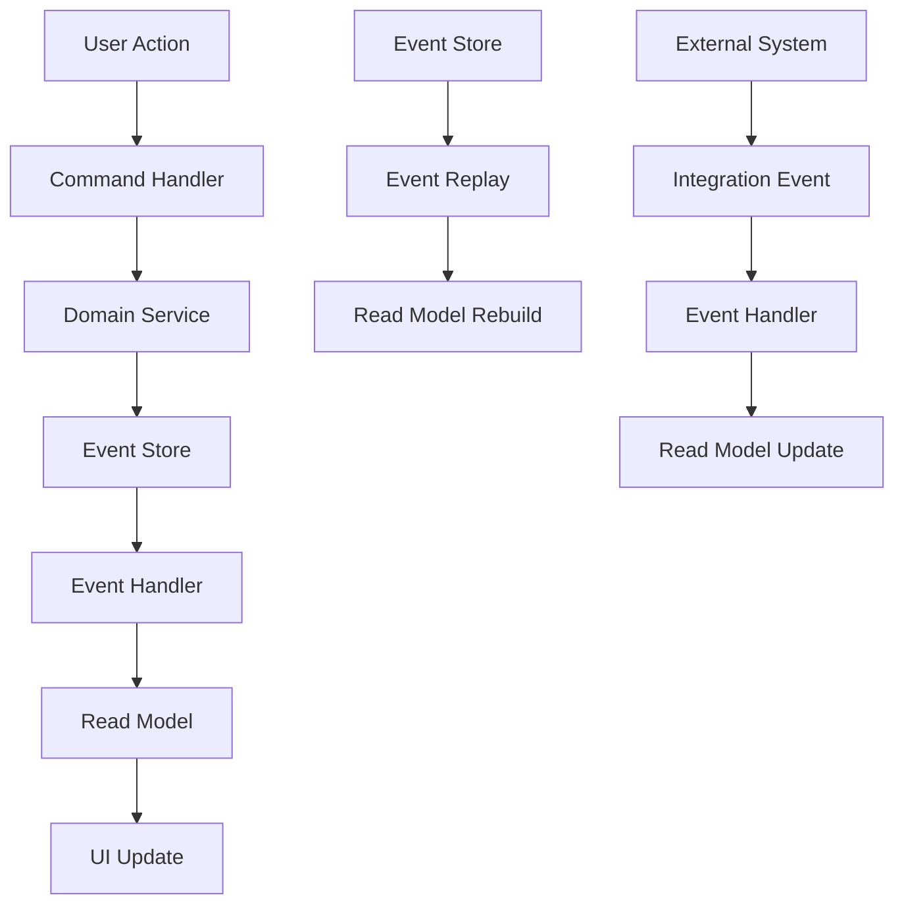

# Phase 2 Preparation Guide

## Overview

This document outlines the preparation and planning for Phase 2 of the AI-BOS ERP platform development. Phase 2 will focus on implementing core ERP modules and advanced features.

---

## 🎯 **Phase 2 Objectives**

### **Primary Goals**
1. **Event Sourcing Foundation**: Implement core ERP architecture with event sourcing
2. **Accounting Module**: Financial management and reporting system
3. **Inventory Module**: Stock management and tracking system
4. **Sales Module**: Customer relationship management
5. **Purchase Module**: Vendor management and procurement

### **Success Criteria**
- **Functional Modules**: All core ERP modules operational
- **Data Integrity**: Event sourcing ensures data consistency
- **Performance**: Maintain <500ms response times
- **Security**: Enterprise-grade security throughout
- **Testing**: 95%+ test coverage maintained

---

## 🏗️ **Architecture Design**

### **Event Sourcing Architecture**



### **Module Architecture**

```
apps/
├── bff/                    # Backend for Frontend
│   ├── modules/
│   │   ├── accounting/     # Accounting module
│   │   ├── inventory/      # Inventory module
│   │   ├── sales/          # Sales module
│   │   └── purchase/       # Purchase module
│   └── shared/
│       ├── events/         # Event sourcing infrastructure
│       ├── commands/       # Command handlers
│       └── projections/     # Read models
├── web/                    # Frontend application
│   ├── modules/
│   │   ├── accounting/     # Accounting UI
│   │   ├── inventory/      # Inventory UI
│   │   ├── sales/          # Sales UI
│   │   └── purchase/       # Purchase UI
│   └── shared/
│       ├── components/    # Shared UI components
│       └── hooks/          # Shared React hooks
```

---

## 📋 **Module Specifications**

### **1. Accounting Module**

#### **Core Features**
- **Chart of Accounts**: Hierarchical account structure
- **General Ledger**: Double-entry bookkeeping
- **Accounts Payable**: Vendor invoice management
- **Accounts Receivable**: Customer invoice management
- **Financial Reporting**: P&L, Balance Sheet, Cash Flow
- **Budget Management**: Budget planning and tracking
- **Tax Management**: Tax calculation and reporting

#### **Technical Requirements**
- **Event Sourcing**: All accounting transactions as events
- **Double-Entry**: Enforce double-entry bookkeeping rules
- **Audit Trail**: Complete audit trail for all transactions
- **Multi-Currency**: Support for multiple currencies
- **Fiscal Periods**: Support for different fiscal periods
- **Compliance**: GAAP and IFRS compliance

#### **API Endpoints**
```typescript
// Chart of Accounts
GET /api/accounting/accounts
POST /api/accounting/accounts
PUT /api/accounting/accounts/:id
DELETE /api/accounting/accounts/:id

// General Ledger
GET /api/accounting/ledger/entries
POST /api/accounting/ledger/entries
GET /api/accounting/ledger/balance/:accountId

// Financial Reports
GET /api/accounting/reports/profit-loss
GET /api/accounting/reports/balance-sheet
GET /api/accounting/reports/cash-flow
```

### **2. Inventory Module**

#### **Core Features**
- **Item Management**: Product and service catalog
- **Stock Tracking**: Real-time inventory levels
- **Warehouse Management**: Multi-location inventory
- **Stock Movements**: Receipts, issues, transfers
- **Inventory Valuation**: FIFO, LIFO, Weighted Average
- **Reorder Management**: Automatic reorder points
- **Inventory Reports**: Stock levels, movements, valuation

#### **Technical Requirements**
- **Real-time Updates**: Live inventory updates
- **Batch Tracking**: Track items by batch/lot
- **Serial Number Tracking**: Track individual items
- **Multi-location**: Support multiple warehouses
- **Integration**: Integrate with accounting module
- **Barcode Support**: Barcode scanning capabilities

#### **API Endpoints**
```typescript
// Item Management
GET /api/inventory/items
POST /api/inventory/items
PUT /api/inventory/items/:id
DELETE /api/inventory/items/:id

// Stock Management
GET /api/inventory/stock/:itemId
POST /api/inventory/stock/movements
GET /api/inventory/stock/movements

// Warehouse Management
GET /api/inventory/warehouses
POST /api/inventory/warehouses
PUT /api/inventory/warehouses/:id
```

### **3. Sales Module**

#### **Core Features**
- **Customer Management**: Customer database and relationships
- **Quotation Management**: Sales quotations and proposals
- **Sales Orders**: Order processing and fulfillment
- **Invoicing**: Sales invoice generation
- **Payment Tracking**: Payment collection and tracking
- **Sales Analytics**: Sales performance and analytics
- **CRM Integration**: Customer relationship management

#### **Technical Requirements**
- **Customer Portal**: Self-service customer portal
- **Document Generation**: PDF generation for quotes/invoices
- **Payment Integration**: Payment gateway integration
- **Email Integration**: Automated email notifications
- **Sales Pipeline**: Track sales opportunities
- **Commission Tracking**: Sales commission management

#### **API Endpoints**
```typescript
// Customer Management
GET /api/sales/customers
POST /api/sales/customers
PUT /api/sales/customers/:id
DELETE /api/sales/customers/:id

// Sales Orders
GET /api/sales/orders
POST /api/sales/orders
PUT /api/sales/orders/:id
GET /api/sales/orders/:id/invoice

// Quotations
GET /api/sales/quotations
POST /api/sales/quotations
PUT /api/sales/quotations/:id
POST /api/sales/quotations/:id/convert-to-order
```

### **4. Purchase Module**

#### **Core Features**
- **Vendor Management**: Supplier database and relationships
- **Purchase Requisitions**: Internal purchase requests
- **Purchase Orders**: Vendor order management
- **Goods Receipt**: Receipt and inspection of goods
- **Vendor Invoicing**: Vendor invoice processing
- **Payment Management**: Vendor payment processing
- **Purchase Analytics**: Procurement analytics and reporting

#### **Technical Requirements**
- **Approval Workflow**: Multi-level approval process
- **Three-way Matching**: PO, Receipt, Invoice matching
- **Vendor Portal**: Self-service vendor portal
- **Contract Management**: Vendor contract management
- **Spend Analytics**: Procurement spend analysis
- **Compliance**: Procurement compliance tracking

#### **API Endpoints**
```typescript
// Vendor Management
GET /api/purchase/vendors
POST /api/purchase/vendors
PUT /api/purchase/vendors/:id
DELETE /api/purchase/vendors/:id

// Purchase Orders
GET /api/purchase/orders
POST /api/purchase/orders
PUT /api/purchase/orders/:id
POST /api/purchase/orders/:id/receive

// Purchase Requisitions
GET /api/purchase/requisitions
POST /api/purchase/requisitions
PUT /api/purchase/requisitions/:id
POST /api/purchase/requisitions/:id/approve
```

---

## 🛠️ **Technical Implementation**

### **Event Sourcing Infrastructure**

#### **Event Store**
```typescript
interface EventStore {
  append(streamId: string, events: DomainEvent[]): Promise<void>;
  getEvents(streamId: string): Promise<DomainEvent[]>;
  getEventsFromVersion(streamId: string, version: number): Promise<DomainEvent[]>;
  subscribe(eventType: string, handler: EventHandler): void;
}
```

#### **Command Handlers**
```typescript
interface CommandHandler<T extends Command> {
  handle(command: T): Promise<void>;
}

class CreateAccountCommandHandler implements CommandHandler<CreateAccountCommand> {
  constructor(
    private eventStore: EventStore,
    private accountRepository: AccountRepository
  ) {}

  async handle(command: CreateAccountCommand): Promise<void> {
    const account = Account.create(command);
    const events = account.getUncommittedEvents();
    await this.eventStore.append(account.id, events);
    account.markEventsAsCommitted();
  }
}
```

#### **Read Models**
```typescript
interface ReadModel {
  handle(event: DomainEvent): Promise<void>;
}

class AccountReadModel implements ReadModel {
  constructor(private database: Database) {}

  async handle(event: AccountCreatedEvent): Promise<void> {
    await this.database.accounts.insert({
      id: event.accountId,
      name: event.name,
      type: event.type,
      createdAt: event.timestamp
    });
  }
}
```

### **Database Schema**

#### **Event Store Tables**
```sql
-- Events table
CREATE TABLE events (
  id UUID PRIMARY KEY,
  stream_id VARCHAR(255) NOT NULL,
  version INTEGER NOT NULL,
  event_type VARCHAR(255) NOT NULL,
  event_data JSONB NOT NULL,
  metadata JSONB,
  created_at TIMESTAMP DEFAULT NOW(),
  UNIQUE(stream_id, version)
);

-- Snapshots table
CREATE TABLE snapshots (
  stream_id VARCHAR(255) PRIMARY KEY,
  version INTEGER NOT NULL,
  snapshot_data JSONB NOT NULL,
  created_at TIMESTAMP DEFAULT NOW()
);
```

#### **Read Model Tables**
```sql
-- Accounts read model
CREATE TABLE accounts (
  id UUID PRIMARY KEY,
  name VARCHAR(255) NOT NULL,
  type VARCHAR(100) NOT NULL,
  parent_id UUID REFERENCES accounts(id),
  code VARCHAR(50) UNIQUE,
  is_active BOOLEAN DEFAULT TRUE,
  created_at TIMESTAMP DEFAULT NOW(),
  updated_at TIMESTAMP DEFAULT NOW()
);

-- Inventory items read model
CREATE TABLE inventory_items (
  id UUID PRIMARY KEY,
  sku VARCHAR(100) UNIQUE NOT NULL,
  name VARCHAR(255) NOT NULL,
  description TEXT,
  category_id UUID REFERENCES categories(id),
  unit_of_measure VARCHAR(50),
  cost_price DECIMAL(10,2),
  selling_price DECIMAL(10,2),
  reorder_level INTEGER,
  is_active BOOLEAN DEFAULT TRUE,
  created_at TIMESTAMP DEFAULT NOW(),
  updated_at TIMESTAMP DEFAULT NOW()
);
```

---

## 🧪 **Testing Strategy**

### **Event Sourcing Testing**

#### **Command Handler Tests**
```typescript
describe('CreateAccountCommandHandler', () => {
  it('should create account and emit AccountCreatedEvent', async () => {
    const command = new CreateAccountCommand('Cash', 'Asset');
    const handler = new CreateAccountCommandHandler(mockEventStore, mockRepository);
    
    await handler.handle(command);
    
    expect(mockEventStore.append).toHaveBeenCalledWith(
      expect.any(String),
      expect.arrayContaining([
        expect.objectContaining({
          type: 'AccountCreatedEvent',
          name: 'Cash',
          accountType: 'Asset'
        })
      ])
    );
  });
});
```

#### **Read Model Tests**
```typescript
describe('AccountReadModel', () => {
  it('should update read model when AccountCreatedEvent is received', async () => {
    const event = new AccountCreatedEvent('account-123', 'Cash', 'Asset');
    const readModel = new AccountReadModel(mockDatabase);
    
    await readModel.handle(event);
    
    expect(mockDatabase.accounts.insert).toHaveBeenCalledWith({
      id: 'account-123',
      name: 'Cash',
      type: 'Asset',
      createdAt: expect.any(Date)
    });
  });
});
```

### **Integration Testing**

#### **End-to-End Tests**
```typescript
describe('Accounting Module E2E', () => {
  it('should create account and update read model', async () => {
    // Create account
    const response = await request(app)
      .post('/api/accounting/accounts')
      .send({ name: 'Cash', type: 'Asset' })
      .expect(201);
    
    // Verify read model
    const account = await request(app)
      .get(`/api/accounting/accounts/${response.body.id}`)
      .expect(200);
    
    expect(account.body.name).toBe('Cash');
    expect(account.body.type).toBe('Asset');
  });
});
```

---

## 📊 **Performance Considerations**

### **Event Sourcing Performance**

#### **Optimization Strategies**
1. **Event Snapshots**: Regular snapshots to reduce event replay time
2. **Read Model Caching**: Cache frequently accessed read models
3. **Event Batching**: Batch events for better performance
4. **Async Processing**: Process read models asynchronously
5. **Database Indexing**: Optimize database indexes for read models

#### **Monitoring**
- **Event Processing Time**: Monitor event processing latency
- **Read Model Lag**: Monitor read model update lag
- **Database Performance**: Monitor database query performance
- **Memory Usage**: Monitor memory usage for event processing

---

## 🔒 **Security Considerations**

### **Event Sourcing Security**

#### **Security Measures**
1. **Event Encryption**: Encrypt sensitive event data
2. **Access Control**: Role-based access to events
3. **Audit Trail**: Complete audit trail for all events
4. **Data Retention**: Implement data retention policies
5. **Compliance**: Ensure regulatory compliance

#### **Security Implementation**
```typescript
interface SecureEventStore extends EventStore {
  append(streamId: string, events: DomainEvent[], userId: string): Promise<void>;
  getEvents(streamId: string, userId: string): Promise<DomainEvent[]>;
  encryptEvent(event: DomainEvent): EncryptedEvent;
  decryptEvent(encryptedEvent: EncryptedEvent): DomainEvent;
}
```

---

## 📚 **Documentation Requirements**

### **Phase 2 Documentation**

#### **Required Documentation**
1. **Event Sourcing Guide**: Comprehensive event sourcing documentation
2. **Module Documentation**: Each module's API and usage
3. **Database Schema**: Complete database schema documentation
4. **Integration Guide**: Module integration and communication
5. **Performance Guide**: Performance optimization and monitoring
6. **Security Guide**: Security implementation and best practices

#### **Documentation Structure**
```
docs/
├── phase2/
│   ├── event-sourcing/
│   │   ├── overview.md
│   │   ├── implementation.md
│   │   └── best-practices.md
│   ├── modules/
│   │   ├── accounting/
│   │   ├── inventory/
│   │   ├── sales/
│   │   └── purchase/
│   ├── integration/
│   │   ├── module-communication.md
│   │   └── data-flow.md
│   └── performance/
│       ├── optimization.md
│       └── monitoring.md
```

---

## 🚀 **Implementation Timeline**

### **Phase 2 Schedule (8 weeks)**

#### **Week 1-2: Event Sourcing Foundation**
- **Week 1**: Event sourcing infrastructure setup
- **Week 2**: Command handlers and event handlers

#### **Week 3-4: Accounting Module**
- **Week 3**: Chart of accounts and general ledger
- **Week 4**: Financial reporting and compliance

#### **Week 5-6: Inventory Module**
- **Week 5**: Item management and stock tracking
- **Week 6**: Warehouse management and valuation

#### **Week 7-8: Sales & Purchase Modules**
- **Week 7**: Sales module implementation
- **Week 8**: Purchase module implementation

### **Milestones**
- **Week 2**: Event sourcing foundation complete
- **Week 4**: Accounting module complete
- **Week 6**: Inventory module complete
- **Week 8**: All modules complete and integrated

---

## 🎯 **Success Metrics**

### **Technical Metrics**
- **Event Processing**: <100ms event processing time
- **Read Model Lag**: <1 second read model update lag
- **API Response**: <500ms API response time
- **Test Coverage**: 95%+ test coverage maintained
- **Performance**: All SLOs met

### **Business Metrics**
- **Module Functionality**: All core ERP functions operational
- **Data Integrity**: 100% data consistency
- **User Experience**: Intuitive and responsive UI
- **Integration**: Seamless module integration
- **Compliance**: Regulatory compliance maintained

---

## 📞 **Next Steps**

### **Immediate Actions**
1. **Team Preparation**: Train team on event sourcing concepts
2. **Infrastructure Setup**: Set up event sourcing infrastructure
3. **Module Planning**: Detailed module implementation planning
4. **Resource Allocation**: Allocate resources for Phase 2

### **Phase 2 Kickoff**
1. **Event Sourcing Workshop**: Team training on event sourcing
2. **Architecture Review**: Review and approve architecture design
3. **Implementation Start**: Begin event sourcing infrastructure
4. **Progress Tracking**: Establish progress tracking and reporting

---

**Phase 2 Preparation Complete - Ready for Implementation! 🚀**
