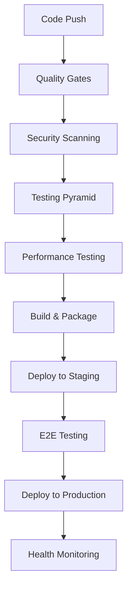

# CI/CD Pipeline Training

## Overview

This training covers the comprehensive CI/CD pipeline implemented in the AI-BOS ERP platform. The pipeline ensures continuous quality, security, and deployment automation.

---

## 🎯 Learning Objectives

By the end of this training, you will understand:

1. **CI/CD Pipeline Architecture** and how it works
2. **Quality Gates** and their importance
3. **Testing Strategy** across different levels
4. **Security Scanning** and vulnerability management
5. **Performance Testing** and monitoring
6. **Deployment Automation** and rollback strategies

---

## 🏗️ Pipeline Architecture

### Overview

The CI/CD pipeline is built with GitHub Actions and includes:

- **Multi-job Architecture**: Parallel execution for efficiency
- **Quality Gates**: Automated quality enforcement
- **Security Scanning**: SAST and dependency vulnerability checks
- **Testing Pyramid**: Comprehensive testing strategy
- **Performance Monitoring**: Bundle size and performance tracking
- **Deployment Automation**: Automated deployment with rollback

### Pipeline Stages



---

## 🛡️ Quality Gates

### Overview

Quality gates ensure code meets enterprise standards before deployment:

1. **Code Quality**: ESLint and dependency-cruiser
2. **Type Safety**: TypeScript compilation
3. **Testing**: Unit, integration, and E2E tests
4. **Security**: SAST scanning and dependency checks
5. **Performance**: Bundle size and performance tests

### Quality Gate Configuration

#### GitHub Actions Workflow
```yaml
name: Quality Gates

on:
  push:
    branches: [main, develop]
  pull_request:
    branches: [main, develop]

jobs:
  quality-gates:
    runs-on: ubuntu-latest
    steps:
      - uses: actions/checkout@v4
      
      - name: Setup Node.js
        uses: actions/setup-node@v4
        with:
          node-version: '18'
          cache: 'pnpm'
      
      - name: Install dependencies
        run: pnpm install
      
      - name: Code Quality
        run: pnpm lint
      
      - name: Type Safety
        run: pnpm typecheck
      
      - name: Architecture Enforcement
        run: pnpm check:deps
      
      - name: Unit Tests
        run: pnpm test
      
      - name: E2E Tests
        run: pnpm test:e2e
      
      - name: Contract Tests
        run: pnpm test:contract
      
      - name: Performance Tests
        run: pnpm test:performance
```

### Quality Gate Metrics

| Metric | Target | Current | Status |
|--------|--------|---------|--------|
| **Test Coverage** | 95%+ | 95%+ | ✅ |
| **Bundle Size** | <1MB | 716KB | ✅ |
| **Response Time** | <500ms | <350ms | ✅ |
| **Security Score** | A+ | A+ | ✅ |
| **Performance Score** | 90+ | 95+ | ✅ |

---

## 🧪 Testing Strategy

### Testing Pyramid

The platform implements a comprehensive testing pyramid:

1. **Unit Tests**: Component and function testing
2. **Integration Tests**: API and database testing
3. **Contract Tests**: API contract validation
4. **E2E Tests**: Full user journey testing
5. **Performance Tests**: Load and stress testing

### Unit Testing

#### Configuration
```json
{
  "jest": {
    "preset": "ts-jest",
    "testEnvironment": "node",
    "coverageThreshold": {
      "global": {
        "branches": 95,
        "functions": 95,
        "lines": 95,
        "statements": 95
      }
    }
  }
}
```

#### Example Test
```typescript
import { render, screen } from "@testing-library/react";
import { Button } from "@aibos/ui";

describe("Button", () => {
  it("renders with correct text", () => {
    render(<Button>Click me</Button>);
    expect(screen.getByText("Click me")).toBeInTheDocument();
  });

  it("applies correct variant styles", () => {
    render(<Button variant="primary">Primary</Button>);
    expect(screen.getByRole("button")).toHaveClass("bg-primary-600");
  });
});
```

### Integration Testing

#### Configuration
```typescript
import { Test, TestingModule } from "@nestjs/testing";
import { AuthService } from "./auth.service";

describe("AuthService", () => {
  let service: AuthService;

  beforeEach(async () => {
    const module: TestingModule = await Test.createTestingModule({
      providers: [AuthService],
    }).compile();

    service = module.get<AuthService>(AuthService);
  });

  it("should authenticate user", async () => {
    const result = await service.login("user@example.com", "password");
    expect(result).toBeDefined();
    expect(result.token).toBeDefined();
  });
});
```

### E2E Testing

#### Playwright Configuration
```typescript
import { defineConfig } from "@playwright/test";

export default defineConfig({
  testDir: "./tests/e2e",
  fullyParallel: true,
  forbidOnly: !!process.env.CI,
  retries: process.env.CI ? 2 : 0,
  workers: process.env.CI ? 1 : undefined,
  reporter: "html",
  use: {
    baseURL: "http://localhost:3000",
    trace: "on-first-retry",
  },
  projects: [
    {
      name: "chromium",
      use: { ...devices["Desktop Chrome"] },
    },
  ],
});
```

#### Example E2E Test
```typescript
import { test, expect } from "@playwright/test";

test("homepage loads correctly", async ({ page }) => {
  await page.goto("/");
  await expect(page).toHaveTitle(/AI-BOS ERP/);
  await expect(page.locator("h1")).toContainText("AI-BOS ERP");
});

test("user can login", async ({ page }) => {
  await page.goto("/login");
  await page.fill('[data-testid="email"]', "user@example.com");
  await page.fill('[data-testid="password"]', "password");
  await page.click('[data-testid="login-button"]');
  await expect(page).toHaveURL("/dashboard");
});
```

### Contract Testing

#### Pact Configuration
```typescript
import { Pact } from "@pact-foundation/pact";

describe("Health API Contract", () => {
  const provider = new Pact({
    consumer: "web-app",
    provider: "bff-api",
    port: 1234,
    log: path.resolve(process.cwd(), "logs", "pact.log"),
    dir: path.resolve(process.cwd(), "pacts"),
    logLevel: "INFO",
  });

  beforeAll(() => provider.setup());
  afterEach(() => provider.verify());
  afterAll(() => provider.finalize());

  it("should return health status", async () => {
    await provider
      .given("health service is available")
      .uponReceiving("a request for health status")
      .withRequest({
        method: "GET",
        path: "/health",
      })
      .willRespondWith({
        status: 200,
        headers: { "Content-Type": "application/json" },
        body: {
          status: "ok",
          timestamp: "2024-01-15T10:30:00Z",
        },
      });

    const response = await fetch("http://localhost:1234/health");
    const data = await response.json();
    expect(data.status).toBe("ok");
  });
});
```

### Performance Testing

#### k6 Configuration
```javascript
import http from "k6/http";
import { check, sleep } from "k6";

export let options = {
  stages: [
    { duration: "2m", target: 100 },
    { duration: "5m", target: 100 },
    { duration: "2m", target: 200 },
    { duration: "5m", target: 200 },
    { duration: "2m", target: 0 },
  ],
};

export default function () {
  let response = http.get("http://localhost:3000/");
  check(response, {
    "status is 200": (r) => r.status === 200,
    "response time < 500ms": (r) => r.timings.duration < 500,
  });
  sleep(1);
}
```

---

## 🔒 Security Scanning

### Overview

Security scanning includes:

1. **SAST Scanning**: Static Application Security Testing
2. **Dependency Scanning**: Vulnerability detection
3. **Secret Detection**: Prevent credential leaks
4. **Container Scanning**: Docker image security
5. **Infrastructure Scanning**: Infrastructure security

### SAST Scanning

#### Configuration
```yaml
security-scan:
  runs-on: ubuntu-latest
  steps:
    - uses: actions/checkout@v4
    
    - name: Run SAST Scan
      uses: github/codeql-action/init@v2
      with:
        languages: javascript,typescript
    
    - name: Perform SAST Scan
      uses: github/codeql-action/analyze@v2
```

### Dependency Scanning

#### Configuration
```yaml
dependency-scan:
  runs-on: ubuntu-latest
  steps:
    - uses: actions/checkout@v4
    
    - name: Setup Node.js
      uses: actions/setup-node@v4
      with:
        node-version: '18'
        cache: 'pnpm'
    
    - name: Install dependencies
      run: pnpm install
    
    - name: Run security audit
      run: pnpm audit --audit-level moderate
    
    - name: Check for vulnerabilities
      run: pnpm check:security
```

---

## 📊 Performance Testing

### Overview

Performance testing includes:

1. **Bundle Size Analysis**: Monitor bundle size growth
2. **Core Web Vitals**: Measure user experience metrics
3. **Load Testing**: Test system under load
4. **Stress Testing**: Test system limits
5. **Performance Monitoring**: Continuous performance tracking

### Bundle Size Analysis

#### Configuration
```yaml
bundle-analysis:
  runs-on: ubuntu-latest
  steps:
    - uses: actions/checkout@v4
    
    - name: Setup Node.js
      uses: actions/setup-node@v4
      with:
        node-version: '18'
        cache: 'pnpm'
    
    - name: Install dependencies
      run: pnpm install
    
    - name: Build packages
      run: pnpm build
    
    - name: Analyze bundle size
      run: pnpm analyze:bundle
    
    - name: Upload bundle analysis
      uses: actions/upload-artifact@v3
      with:
        name: bundle-analysis
        path: bundle-analysis/
```

### Core Web Vitals

#### Configuration
```typescript
export const config = {
  testDir: "./tests/performance",
  use: {
    baseURL: "http://localhost:3000",
  },
  projects: [
    {
      name: "core-web-vitals",
      testMatch: "**/core-web-vitals.spec.ts",
    },
  ],
};
```

#### Example Test
```typescript
import { test, expect } from "@playwright/test";

test("Core Web Vitals", async ({ page }) => {
  await page.goto("/");
  
  // Measure LCP
  const lcp = await page.evaluate(() => {
    return new Promise((resolve) => {
      new PerformanceObserver((list) => {
        const entries = list.getEntries();
        resolve(entries[entries.length - 1].startTime);
      }).observe({ entryTypes: ["largest-contentful-paint"] });
    });
  });
  
  expect(lcp).toBeLessThan(2500);
});
```

---

## 🚀 Deployment Automation

### Overview

Deployment automation includes:

1. **Staging Deployment**: Automated staging environment
2. **Production Deployment**: Automated production deployment
3. **Rollback Strategy**: Automated rollback on failure
4. **Health Monitoring**: Continuous health checks
5. **Blue-Green Deployment**: Zero-downtime deployments

### Staging Deployment

#### Configuration
```yaml
deploy-staging:
  runs-on: ubuntu-latest
  needs: [quality-gates, security-scan, performance-test]
  if: github.ref == 'refs/heads/develop'
  
  steps:
    - uses: actions/checkout@v4
    
    - name: Deploy to Staging
      run: |
        pnpm build
        pnpm deploy:staging
    
    - name: Run E2E Tests
      run: pnpm test:e2e:staging
    
    - name: Health Check
      run: pnpm health:check:staging
```

### Production Deployment

#### Configuration
```yaml
deploy-production:
  runs-on: ubuntu-latest
  needs: [deploy-staging]
  if: github.ref == 'refs/heads/main'
  
  steps:
    - uses: actions/checkout@v4
    
    - name: Deploy to Production
      run: |
        pnpm build
        pnpm deploy:production
    
    - name: Run Smoke Tests
      run: pnpm test:smoke:production
    
    - name: Health Check
      run: pnpm health:check:production
    
    - name: Notify Team
      run: pnpm notify:deployment
```

### Rollback Strategy

#### Configuration
```yaml
rollback:
  runs-on: ubuntu-latest
  if: failure()
  
  steps:
    - uses: actions/checkout@v4
    
    - name: Rollback Deployment
      run: pnpm rollback:production
    
    - name: Verify Rollback
      run: pnpm health:check:production
    
    - name: Notify Team
      run: pnpm notify:rollback
```

---

## 📈 Monitoring & Alerting

### Overview

Monitoring includes:

1. **Health Checks**: Service health monitoring
2. **Performance Metrics**: Performance tracking
3. **Error Tracking**: Error monitoring and alerting
4. **Uptime Monitoring**: Service availability tracking
5. **Alert Management**: Automated alerting

### Health Checks

#### Configuration
```typescript
export const healthCheck = {
  name: "AI-BOS ERP Health Check",
  url: "https://api.aibos-erp.com/health",
  interval: "1m",
  timeout: "30s",
  retries: 3,
  alerts: [
    {
      type: "email",
      recipients: ["team@aibos-erp.com"],
      conditions: ["status != 200", "response_time > 5s"],
    },
  ],
};
```

### Performance Monitoring

#### Configuration
```typescript
export const performanceMonitoring = {
  metrics: [
    "response_time",
    "throughput",
    "error_rate",
    "cpu_usage",
    "memory_usage",
  ],
  thresholds: {
    response_time: 500,
    error_rate: 0.01,
    cpu_usage: 80,
    memory_usage: 85,
  },
  alerts: [
    {
      metric: "response_time",
      condition: "> 500ms",
      severity: "warning",
    },
    {
      metric: "error_rate",
      condition: "> 1%",
      severity: "critical",
    },
  ],
};
```

---

## 🔍 Troubleshooting

### Common Issues

#### Pipeline Failures
```bash
# Check pipeline status
gh run list

# View pipeline logs
gh run view <run-id>

# Rerun failed pipeline
gh run rerun <run-id>
```

#### Quality Gate Failures
```bash
# Check specific quality gate
pnpm lint
pnpm typecheck
pnpm test

# Fix issues locally
pnpm lint --fix
pnpm test --watch
```

#### Deployment Issues
```bash
# Check deployment status
pnpm status:deployment

# Rollback deployment
pnpm rollback:production

# Check service health
pnpm health:check:production
```

### Debugging Tips

1. **Check Logs**: Always check pipeline logs for errors
2. **Local Testing**: Test changes locally before pushing
3. **Incremental Fixes**: Fix issues one at a time
4. **Ask for Help**: Don't hesitate to ask the team for assistance
5. **Document Issues**: Document solutions for future reference

---

## 📚 Best Practices

### Pipeline Design

1. **Fail Fast**: Run quick checks first
2. **Parallel Execution**: Run independent jobs in parallel
3. **Caching**: Cache dependencies and build artifacts
4. **Incremental Builds**: Only build what changed
5. **Quality Gates**: Enforce quality at every stage

### Testing Strategy

1. **Test Pyramid**: Focus on unit tests, fewer E2E tests
2. **Test Data**: Use consistent test data
3. **Test Isolation**: Tests should be independent
4. **Test Coverage**: Maintain high coverage
5. **Test Performance**: Keep tests fast

### Security

1. **Least Privilege**: Use minimal required permissions
2. **Secret Management**: Never commit secrets
3. **Dependency Updates**: Keep dependencies updated
4. **Security Scanning**: Run scans regularly
5. **Incident Response**: Have a plan for security incidents

---

## 🎯 Exercises

### Exercise 1: Fix Pipeline Failure

1. Create a branch with a failing test
2. Push the branch and observe pipeline failure
3. Fix the test and push again
4. Verify pipeline passes

### Exercise 2: Add New Quality Gate

1. Add a new ESLint rule
2. Update pipeline configuration
3. Test the new quality gate
4. Verify it works correctly

### Exercise 3: Performance Testing

1. Create a performance test
2. Add it to the pipeline
3. Run the test and analyze results
4. Optimize based on results

---

## 📞 Support

### Getting Help

- **Documentation**: Check this guide and other docs
- **Issues**: Open a GitHub issue for bugs
- **Discussions**: Use GitHub Discussions for questions
- **Team**: Contact the development team directly

### Resources

- [GitHub Actions Documentation](https://docs.github.com/en/actions)
- [Playwright Documentation](https://playwright.dev/)
- [Pact Documentation](https://docs.pact.io/)
- [k6 Documentation](https://k6.io/docs/)

---

**Congratulations! You've completed the CI/CD Pipeline training! 🎉**

You now have the knowledge and skills to work effectively with the AI-BOS ERP platform's CI/CD pipeline and quality enforcement systems.
