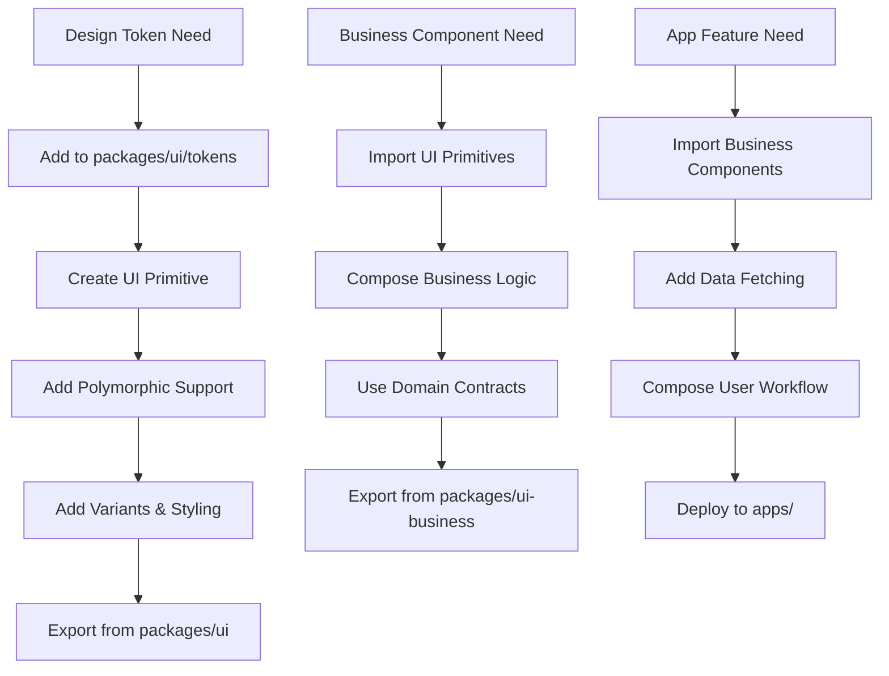

# AIBOS UI/UX Guidelines & Ecosystem Architecture

**Comprehensive guidelines for maintaining a clean, scalable UI/UX ecosystem**

## 📋 Table of Contents

1. [Architecture Overview](#architecture-overview)
2. [Layer Hierarchy](#layer-hierarchy)
3. [Design System Flow](#design-system-flow)
4. [Component Development Guidelines](#component-development-guidelines)
5. [Dependency Management](#dependency-management)
6. [Refactoring Strategy](#refactoring-strategy)
7. [Quality Gates](#quality-gates)
8. [Migration Patterns](#migration-patterns)
9. [Best Practices](#best-practices)
10. [Troubleshooting](#troubleshooting)

## 🏗️ Architecture Overview

### Ecosystem Layers

```
┌─────────────────────────────────────────────────────────────┐
│                    APPLICATION LAYER                        │
│  apps/web, apps/bff, apps/mobile                           │
│  • Business logic implementation                           │
│  • User workflows and interactions                          │
│  • Data fetching and state management                       │
└─────────────────────────────────────────────────────────────┘
                              │
                              ▼
┌─────────────────────────────────────────────────────────────┐
│                   UI-BUSINESS LAYER                         │
│  packages/ui-business                                       │
│  • Domain-specific components (CFO Dashboard, etc.)         │
│  • Business workflows and complex interactions            │
│  • Domain contracts integration                            │
└─────────────────────────────────────────────────────────────┘
                              │
                              ▼
┌─────────────────────────────────────────────────────────────┐
│                     UI PRIMITIVES LAYER                     │
│  packages/ui                                               │
│  • Design tokens and semantic system                        │
│  • Atomic components (Button, Input, Badge)               │
│  • Molecular components (Card, Modal, Table)              │
│  • Utilities and hooks                                     │
└─────────────────────────────────────────────────────────────┘
```

## 🎯 Layer Hierarchy

### 1. UI Primitives Layer (`packages/ui`)

**Purpose**: Foundation design system with zero business logic

**Responsibilities**:
- Design tokens and semantic naming
- Atomic components (Button, Input, Badge, etc.)
- Molecular components (Card, Modal, VirtualTable, etc.)
- Utilities (cn, variants, createPolymorphic)
- Hooks (useTheme, useMediaQuery, etc.)
- Anti-drift protection and quality gates

**Rules**:
- ✅ **NO business logic** - Pure UI components only
- ✅ **NO domain-specific data types** - Generic TypeScript types only
- ✅ **NO external API calls** - Stateless components only
- ✅ **Polymorphic components** - All components support `as` prop
- ✅ **Semantic tokens only** - No hardcoded colors/values
- ✅ **Tree-shaking optimized** - Individual exports available

**Example**:
```tsx
// ✅ Good - Pure UI component
export const Button = createPolymorphic<'button'>(
  ({ as: Component = 'button', variant, size, children, ...props }, ref) => (
    <Component
      ref={ref}
      className={cn(buttonVariants({ variant, size }), className)}
      {...props}
    >
      {children}
    </Component>
  ),
  'Button'
);

// ❌ Bad - Business logic in UI layer
export const CFOButton = ({ onExportBoardPack, ...props }) => {
  // Business logic should be in ui-business layer
};
```

### 2. UI-Business Layer (`packages/ui-business`)

**Purpose**: Business-domain components built on UI primitives

**Responsibilities**:
- Domain-specific components (CFO Dashboard, Accounting Forms, etc.)
- Business workflows and complex interactions
- Integration with domain contracts (`@aibos/accounting-contracts`)
- Business state management and data transformation
- Domain-specific styling and layouts

**Rules**:
- ✅ **Compose UI primitives** - Build using `@aibos/ui` components
- ✅ **Domain contracts** - Use types from domain packages
- ✅ **Business logic allowed** - Handle domain-specific workflows
- ✅ **NO design tokens** - Import from `@aibos/ui/tokens`
- ✅ **NO generic UI components** - Domain-specific only
- ✅ **Clean separation** - One domain per folder

**Example**:
```tsx
// ✅ Good - Business component using UI primitives
import { Card, Badge, VirtualTable, tokens } from '@aibos/ui';
import { CFODashboardData } from '@aibos/accounting-contracts';

export function OutstandingCFODashboard({ 
  data, 
  onExportBoardPack 
}: OutstandingCFODashboardProps) {
  return (
    <Card className="cfo-dashboard">
      <VirtualTable 
        data={data.kpis} 
        columns={kpiColumns}
        onRowClick={handleKPIClick}
      />
      <Badge variant="success">{data.status}</Badge>
    </Card>
  );
}

// ❌ Bad - Generic UI component in business layer
export function GenericTable({ data, columns }) {
  // This belongs in UI primitives layer
};
```

### 3. Application Layer (`apps/`)

**Purpose**: Complete applications using business components

**Responsibilities**:
- User workflows and page composition
- Data fetching and state management
- Routing and navigation
- Integration with BFF and external APIs
- Application-specific configuration

**Rules**:
- ✅ **Compose business components** - Use `@aibos/ui-business` components
- ✅ **Business logic coordination** - Orchestrate domain workflows
- ✅ **Data fetching** - Handle API calls and state
- ✅ **NO UI component creation** - Use existing components
- ✅ **NO design token usage** - Components handle styling

**Example**:
```tsx
// ✅ Good - App composing business components
import { OutstandingCFODashboard } from '@aibos/ui-business';
import { useCFOData } from '../hooks/useCFOData';

export function CFOPage() {
  const { data, loading, error } = useCFOData();
  
  return (
    <div className="cfo-page">
      <OutstandingCFODashboard 
        data={data}
        onExportBoardPack={handleExport}
        onOpenDrill={handleDrillDown}
      />
    </div>
  );
}
```

## 🔄 Design System Flow

### Component Creation Flow



### Data Flow

```
Domain Contracts → UI-Business → UI Primitives → Apps
     ↓                ↓              ↓          ↓
  Type Safety    Business Logic   Pure UI   User Workflows
```

## 📝 Component Development Guidelines

### UI Primitives Development

1. **Start with Design Tokens**
   ```tsx
   // packages/ui/tokens/index.ts
   export const tokens = {
     colors: {
       semantic: {
         primary: { /* semantic color definitions */ }
       }
     }
   };
   ```

2. **Create Polymorphic Component**
   ```tsx
   // packages/ui/primitives/button.tsx
   export const Button = createPolymorphic<'button'>(
     ({ as: Component = 'button', variant, size, ...props }, ref) => (
       <Component ref={ref} className={cn(buttonVariants({ variant, size }))} {...props} />
     ),
     'Button'
   );
   ```

3. **Add Variants System**
   ```tsx
   const buttonVariants = variants({
     base: 'inline-flex items-center justify-center rounded-md font-medium',
     variants: {
       variant: { primary: 'bg-semantic-primary', secondary: 'bg-semantic-secondary' },
       size: { sm: 'h-8 px-3', md: 'h-10 px-4', lg: 'h-12 px-6' }
     },
     defaultVariants: { variant: 'primary', size: 'md' },
     strict: true
   });
   ```

4. **Export with Tree-Shaking**
   ```tsx
   // packages/ui/src/index.ts
   export { Button } from './primitives/button';
   export { Card } from './components/card';
   export { tokens } from './tokens';
   ```

### UI-Business Development

1. **Import UI Primitives**
   ```tsx
   import { Card, Badge, VirtualTable, tokens } from '@aibos/ui';
   ```

2. **Use Domain Contracts**
   ```tsx
   import { CFODashboardData, KPI } from '@aibos/accounting-contracts';
   ```

3. **Compose Business Logic**
   ```tsx
   export function OutstandingCFODashboard({ data, onExport }: Props) {
     const handleKPIClick = useCallback((kpi: KPI) => {
       // Business logic here
       onExport(kpi);
     }, [onExport]);
     
     return (
       <Card>
         <VirtualTable data={data.kpis} onRowClick={handleKPIClick} />
       </Card>
     );
   }
   ```

4. **Export from Domain Folder**
   ```tsx
   // packages/ui-business/src/cfo-dashboard/index.ts
   export { OutstandingCFODashboard } from './outstanding-cfo-dashboard';
   ```

## 🔗 Dependency Management

### Allowed Dependencies

| Layer | Can Import From | Cannot Import From |
|-------|----------------|-------------------|
| **UI Primitives** | React, TypeScript, build tools | Any business packages |
| **UI-Business** | UI Primitives, Domain Contracts | Apps, other business packages |
| **Apps** | UI-Business, BFF, external APIs | UI Primitives directly |

### Dependency Rules

```tsx
// ✅ UI Primitives - Only external dependencies
import React from 'react';
import { cn, variants } from '../utils';

// ✅ UI-Business - Can import UI primitives
import { Card, Badge } from '@aibos/ui';
import { CFODashboardData } from '@aibos/accounting-contracts';

// ✅ Apps - Can import business components
import { OutstandingCFODashboard } from '@aibos/ui-business';

// ❌ Apps - Cannot import UI primitives directly
import { Button } from '@aibos/ui'; // Avoid this
```

## 🔧 Refactoring Strategy

### Phase 1: Audit Current State

1. **Identify Violations**
   ```bash
   # Find components that violate layer boundaries
   grep -r "import.*@aibos/ui" apps/
   grep -r "business.*logic" packages/ui/
   ```

2. **Categorize Components**
   - Pure UI components → `packages/ui`
   - Business components → `packages/ui-business`
   - App-specific → `apps/`

### Phase 2: Migrate Components

1. **Move Business Components**
   ```bash
   # Move business components to ui-business
   mv packages/ui/src/components/cfo-dashboard packages/ui-business/src/cfo-dashboard
   ```

2. **Update Imports**
   ```tsx
   // Before
   import { CFODashboard } from '@aibos/ui';
   
   // After
   import { CFODashboard } from '@aibos/ui-business';
   ```

3. **Fix Dependencies**
   ```tsx
   // Ensure ui-business imports from ui, not vice versa
   // packages/ui-business/src/cfo-dashboard/index.ts
   export { OutstandingCFODashboard } from './outstanding-cfo-dashboard';
   ```

### Phase 3: Clean Builds

1. **Update Package Dependencies**
   ```json
   // packages/ui-business/package.json
   {
     "dependencies": {
       "@aibos/ui": "workspace:*",
       "@aibos/accounting-contracts": "workspace:*"
     }
   }
   ```

2. **Update Build Scripts**
   ```json
   // package.json
   {
     "scripts": {
       "build:ui": "pnpm build --filter=@aibos/ui",
       "build:ui-business": "pnpm build --filter=@aibos/ui-business",
       "build:apps": "pnpm build --filter=apps/*"
     }
   }
   ```

## ✅ Quality Gates

### Build Validation

```bash
# 1. Type checking
pnpm typecheck

# 2. Linting with anti-drift rules
pnpm lint

# 3. Build all packages
pnpm build

# 4. Test layer boundaries
pnpm test:boundaries

# 5. Bundle size validation
pnpm size-check
```

### Layer Boundary Tests

```tsx
// tests/layer-boundaries.test.ts
describe('Layer Boundaries', () => {
  it('UI primitives should not import business packages', () => {
    // Test that packages/ui doesn't import from ui-business
  });
  
  it('Apps should not import UI primitives directly', () => {
    // Test that apps import from ui-business, not ui
  });
});
```

## 🚀 Migration Patterns

### Pattern 1: Moving Business Components

```tsx
// Before: packages/ui/src/components/cfo-dashboard.tsx
export function CFODashboard({ data, onExport }) {
  // Business logic mixed with UI
}

// After: packages/ui-business/src/cfo-dashboard/index.ts
import { Card, VirtualTable } from '@aibos/ui';
import { CFODashboardData } from '@aibos/accounting-contracts';

export function OutstandingCFODashboard({ data, onExport }: Props) {
  // Pure business logic using UI primitives
}
```

### Pattern 2: Extracting UI Primitives

```tsx
// Before: Business component with custom UI
export function BusinessTable({ data }) {
  return (
    <div className="custom-table">
      {/* Custom table implementation */}
    </div>
  );
}

// After: Extract to UI primitives
// packages/ui/src/components/virtual-table.tsx
export const VirtualTable = createPolymorphic<'div'>(
  ({ as: Component, data, columns, ...props }, ref) => (
    <Component ref={ref} className={cn(tableVariants())} {...props}>
      {/* Generic table implementation */}
    </Component>
  ),
  'VirtualTable'
);

// packages/ui-business/src/business-table.tsx
import { VirtualTable } from '@aibos/ui';
export function BusinessTable({ data }) {
  return <VirtualTable data={data} columns={businessColumns} />;
}
```

## 📋 Best Practices

### 1. Component Naming

```tsx
// ✅ Good - Clear, descriptive names
export const OutstandingCFODashboard = () => {};
export const JournalEntryForm = () => {};
export const CashFlowForecast = () => {};

// ❌ Bad - Generic or unclear names
export const Dashboard = () => {};
export const Form = () => {};
export const Chart = () => {};
```

### 2. Props Interface Design

```tsx
// ✅ Good - Domain-specific props
interface OutstandingCFODashboardProps {
  tenantId: string;
  period: Period;
  companies: Company[];
  onOpenDrill: (params: DrillParams) => void;
  onExportBoardPack: (params: ExportParams) => void;
}

// ❌ Bad - Generic props
interface DashboardProps {
  data: any;
  onAction: (id: string) => void;
}
```

### 3. Error Handling

```tsx
// ✅ Good - Domain-specific error handling
export function OutstandingCFODashboard({ data, onError }: Props) {
  const [error, setError] = useState<string>();
  
  const handleError = useCallback((error: Error) => {
    setError(error.message);
    onError?.(error);
  }, [onError]);
  
  if (error) {
    return <ErrorBoundary error={error} onRetry={() => setError(undefined)} />;
  }
  
  return <DashboardContent data={data} onError={handleError} />;
}
```

### 4. Performance Optimization

```tsx
// ✅ Good - Memoized business components
export const OutstandingCFODashboard = memo(({ data, onExport }: Props) => {
  const memoizedData = useMemo(() => 
    processCFOData(data), [data]
  );
  
  const handleExport = useCallback((params: ExportParams) => {
    onExport(params);
  }, [onExport]);
  
  return (
    <Card>
      <VirtualTable data={memoizedData} onRowClick={handleExport} />
    </Card>
  );
});
```

## 🔍 Troubleshooting

### Common Issues

1. **Circular Dependencies**
   ```bash
   # Check for circular imports
   pnpm check-circular-deps
   ```

2. **Build Failures**
   ```bash
   # Clean and rebuild
   pnpm clean
   pnpm build:ui
   pnpm build:ui-business
   pnpm build:apps
   ```

3. **Type Errors**
   ```bash
   # Regenerate types
   pnpm typecheck
   pnpm build:types
   ```

4. **Bundle Size Issues**
   ```bash
   # Analyze bundle
   pnpm size-check
   pnpm bundle-analyze
   ```

### Debugging Layer Violations

```tsx
// Add to package.json scripts
{
  "scripts": {
    "debug:boundaries": "node scripts/check-layer-boundaries.js"
  }
}
```

```javascript
// scripts/check-layer-boundaries.js
const fs = require('fs');
const path = require('path');

function checkBoundaries() {
  // Check that packages/ui doesn't import from ui-business
  // Check that apps don't import directly from ui
  // Report violations
}
```

## 📊 Success Metrics

### Quality Metrics

- ✅ **Zero circular dependencies**
- ✅ **Clean build pipeline** (< 2 minutes)
- ✅ **Type safety** (100% TypeScript coverage)
- ✅ **Bundle size** (UI: < 50KB, UI-Business: < 100KB)
- ✅ **Test coverage** (> 90%)

### Developer Experience

- ✅ **Clear separation** of concerns
- ✅ **Predictable component** locations
- ✅ **Easy refactoring** without breaking changes
- ✅ **Fast development** iteration
- ✅ **Consistent patterns** across all layers

---

## 🎯 Next Steps

1. **Audit current implementation** against these guidelines
2. **Create refactoring plan** for violations
3. **Implement quality gates** in CI/CD
4. **Train team** on new patterns
5. **Monitor metrics** and iterate

This guideline ensures a clean, maintainable UI/UX ecosystem that scales with your business needs while maintaining developer productivity and code quality.
